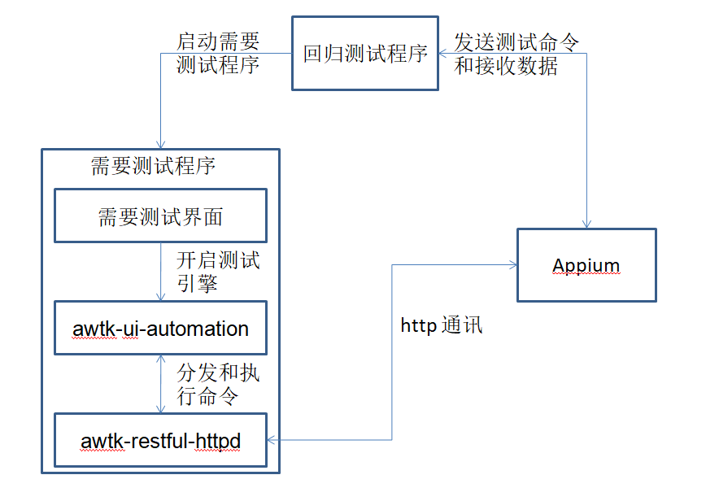

# awtk-regression-test

## 1. 介绍

AWTK 回归测试。

有些需要界面交互的测试，无法放到单元测试里，就放到回归测试里。

一般来说修改代码时，要么通过单元测试验证，要么通过回归测试验证，可以有效避免新加功能或修复BUG时引入新的问题。

## 2. 准备

0. 安装Appium

> 请参考
>
> 1. [在线安装支持 AWTK 自动测试的 appium](https://github.com/zlgopen/awtk-ui-automation/blob/master/docs/how_to_install_appium_for_awtk.md)
> 2. [离线安装支持 AWTK 自动测试的 appium](https://github.com/zlgopen/awtk-ui-automation/blob/master/docs/how_to_install_appium_for_awtk_offline.md)

1. 获取 awtk 并编译

```
git clone https://github.com/zlgopen/awtk.git
cd awtk; scons; cd -
```

2. 获取 awtk-restful-httpd 并编译
```
git clone https://github.com/zlgopen/awtk-restful-httpd.git
cd awtk-restful-httpd; scons; cd -
```

3. 获取 awtk-ui-automation 并编译
```
git clone https://github.com/zlgopen/awtk-ui-automation.git
cd awtk-ui-automation; scons
```

4. 获取 awtk-regression-test 并编译

```
git clone https://github.com/zlgopen/awtk-regression-test.git
cd awtk-regression-test
```

* 生成资源

```
python ./scripts/update_res.py all
```

> 或者通过 designer 生成资源

* 编译PC版本

```
scons
```

* 编译LINUX FB版本

```
scons LINUX_FB=true
```

> 完整编译选项请参考[编译选项](https://github.com/zlgopen/awtk-widget-generator/blob/master/docs/build_options.md)

## 3. 运行

先运行 Appium，点击“Start Server”启动服务。

> 运行自动测试

```
cd uitests

#第一次运行时，先安装依赖的软件包，如果通过离线配置了回归测试的话，就不需要执行这个命令。
npm install

#运行测试，该处会自动运行bin/demo程序
npm run test
```

> 如果无法联网的话，可参考[离线配置回归测试](docs/how_to_install_modules_offline.md)来配置环境。

> 本文以 Linux/MacOS 为例，Windows 可能会微妙差异，请酌情处理。

## 4. 工作原理



> 备注：
>
> 1. **回归测试程序：**是指在 uitests 文件中的 test 程序调用 indexjs 文件（是一个 js 脚本来的），需要用户在该脚本上面编写程序用例。
> 2. **需要测试程序：**就是一开始在 awtk-regression-test 项目中编译的被测试程序，后续需要添加各种需要测试的界面和逻辑。
> 3. **Appium：**是一个第三方的自动化测试工具，是通过 http 协议和需要测试程序通讯，实现自动化测试。

## 5. 文档

* [Appium + AWTK 的工作原理](https://github.com/zlgopen/awtk-ui-automation/blob/master/docs/how_appium_awtk_works.md)
* [在 AWTK 应用中集成自动测试引擎](https://github.com/zlgopen/awtk-ui-automation/blob/master/docs/how_to_integrate_awtktk_ui_automation.md)
* [如何添加回归测试](docs/how_to_add_new_test.md)
* [如何编写测试用例](https://github.com/zlgopen/awtk-ui-automation/blob/master/docs/how_to_write_javascript_test)
* [测试脚本API](https://github.com/zlgopen/awtk-ui-automation/blob/master/docs/api.md)
* [在线安装支持 AWTK 自动测试的 Appium Desktop](docs/how_to_install_appium_for_awtk.md)
* [离线安装支持 AWTK 自动测试的 Appium Desktop](https://github.com/zlgopen/awtk-ui-automation/blob/master/docs/how_to_install_appium_for_awtk_offline.md)
* [离线配置回归测试](docs/how_to_install_modules_offline.md)

